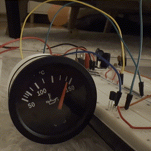
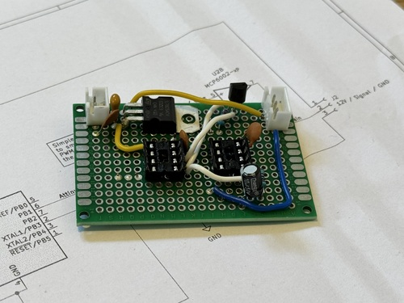
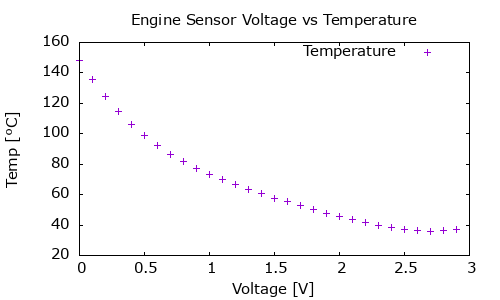

# Building an oil temperature gauge for Porsche 996

## Introduction

This project is about building an oil temperature gauge for a Porsche 911/996.

The car does not have a temperature gauge from the factory and neither does it expose the information on 
the CAN bus so that it can be read by an OBD-II reader.

People have developed different kind of solutions for this problem, but there was one that especially
caught my eye, both because of the design but also reversibility and accuracy of the solution.

## tl;dr
There's been some hiccups on the way, but I have succeeded in building a prototype that can display temperature 
values of my choosing. I have a code snippet that runs from 50ºC to 150ºC with a couple of seconds delay 
between each value. The gauge shows the values.

**I have NOT connected anything to the car yet!**





* [Schematics](vdo_gauge_driver_schematics/vdo_gauge_driver_rev0.2.pdf)
* [Code for ATTiny85](vdo_gauge_driver_sw/vdo_gauge_driver.ino)

## Ahsai's design from 2014

Back in 2014, [Ahsai](https://rennlist.com/forums/members/32590-ahsai.html)
[published a design for a temperature gauge that uses the factory oil level/temperature sensor](https://rennlist.com/forums/996-forum/827720-oil-temp-gauge-using-the-built-in-oil-temp-sensor.html) by
tapping the sensor wire directy on its way to the ECU. This way, the factory ECU is still able to read the oil pressure,
but we can through the tap see it as well.

When you have access to the voltage from the sensor, you can choose to display it in any way you'd like. Back then
Ahsai chose to use the VDO gauge, which fits the design of the interior pretty well.

## Trying to build it in 2025

In April 2025 I decided to try to build it as well.

### Introduction

I looked at the original schematics, but some of the components have already been replaced by newer ones. This meant 
that I would need to redo the schematics, look at all the datasheets and find replacement components.

[Ahsai's Original Schematics](images/ExpressSCH-page-0.jpg)

The circuit itself is fairly simple and smart. It uses an ATTiny85 to convert the voltage from the sensor to a voltage
that drives the VDO gauge.

What we can use from the original design is the values for the sensor signal, or at least the polynomial that 
was used to approximate the conversion values.

### Problem #1, obsolete components

The components in the original design are not available anymore, so we need to find replacements.

For the voltage regulators, that's kind of easy. We can use

* [L7805](datasheets/L78.pdf) for 5V
* ~~[L7812](datasheets/L78.pdf) for 12V (turns out I don't need this one in the end)~~

For the op-amp, the L727M is not available anymore. Moreover it is not rail-to-rail, which means that if the
input drops all the way to 0V, the output will not be able to reach 0V. This is a problem since we need it to
be quite exact.

I set off to find a replacement and found a rail-to-rail op-amp which is easily available.

* [MCP6002](datasheets/mcp6002.pdf)

The microprocessor is still available without problems.

* [ATTiny85](datasheets/attiny85-20pu.pdf)

### Problem #2, the gauge is resistive-type

The original design suggests that you can drive the gauge with voltage. This does not work in reality. The sensor
paired with the gauge seems to be a [NTC thermistor](https://en.wikipedia.org/wiki/Thermistor#NTC_(negative_temperature_coefficient)).

This means that we cannot feed the gauge with the (amplified and converted) voltage from the Porsche sensor.

I am hoping that I can use an N-channel MOSFET to simulate the resistance. This should be drivable by 0-2.5V from the ATTiny85.
Calibration will be needed to get the right display readings.

Right now, I am not really sure how it could ever have worked for Ahsai.

**Solution**: Use a MOSFET to simulate the resistance. I've picked the [2N7000](datasheets/2N7000.pdf) for this.


### Problem 3, the MOSFET is not linear and precise enough

With only the transistor simulating the resistance, I am getting fairly unprecise readings. This is not very good, because
in the beginning of the temperature scale is where I need the most precision, since the oil temperature will likely be
between 50-100°C most of the time.

By making the ATTiny85 output a consistent voltage changes, I could observe the gauge displaying different values depending
on where the needle was moving from.

**Solution**: After a bit of research, it turns out that I could use a current sink with the one op-amp that I have left from the MCP6002.
It was a bit tricky to figure out what the resistor value should be between the source and ground.


#### Problem 3.1, the gauge's internal resistance

Most likely the gauge has some internal resistance and is applying certain voltage on the sensor wire, measuring the voltage drop.

The voltage between the signal pin and ground seems to be 7.5V.

Measuring current using some different resistor values, I got to the following

| R (Ω) | I (mA) | R_int (Ω) |
|-------|--------|-----------|
| 47    | 50     | 103,00    |
| 0     | 59     | 127,12    |

This means, I think, that the internal resistance is likely 100Ω. My cheap multimeter is not very precise, so I am not exactly
sure, but it's at least some ballpark number.

#### Problem 3.2, the current sink values

If we take the above, then we can calculate the currents we want to have through the sensor wire.

* Maximum resistance: 130Ω
* Minimum resistance: 20Ω

Then the currents are:

* Maximum resistance current then: R = 7.5V / 130Ω = 57.69mA
* Minimum resistance current then: R = 7.5V / 20Ω = 375mA

Knowing that we will be driving the MOSFET with a voltage between 0-5V from the ATTiny85, we can calculate
the resistance needed to achieve the above currents, again at least ballpark values.

With R of 22Ω we get these with the different voltages:

| V   | mA          |
|-----|-------------|
| 0,1 | 4,545454545 |
| 1   | 45,45454545 |
| 2   | 90,90909091 |
| 3   | 136,3636364 |
| 4   | 181,8181818 |
| 5   | 227,2727273 |

This is not really exactly what we need, but it is good enough for now. The 5V input would be anyways going over what
the MOSFET can do.

#### Problem 3.3, the op-amp used cannot drive so much current

The MCP6002 op-amp cannot drive as much current as we need. Luckily though, it seems to be able to run the gauge's
pointer all the way to 140ºC, which is good enough for me (for now at least).

### Getting to what value is what

In the original design, Ahsai used Durametric software to get the temperature values (in F) and mapped them to the
voltage observed on the sensor wire.

> [!NOTE]
> I would like to maybe borrow someone's Durametric and check myself. But as of now (May 2025), I trust this data.

[Ahsai's original values](images/Drawing1.jpg), with the polynomial approximated (in F):

```
y = 8.5645 * x^4 - 59.284 * x^3 + 160.76 * x^2 - 245.49x + 299.24
R^2 = 0.9997
```

We can then use this information to build the table of values in Celsius, using a simple [python script](engine_sensor_voltage_temperature.py).
(run `brew install gnuplot` (MacOS) if you don't have it already).



| voltage   | °C       | F       |
|-----------|----------|---------|
| 2.90V     | 37.32°C  | 99.18F  |
| 2.80V     | 36.25°C  | 97.25F  |
| 2.70V     | 35.90°C  | 96.62F  |
| 2.60V     | 36.17°C  | 97.11F  |
| 2.50V     | 36.95°C  | 98.50F  |
| ...        | ...      | ...     |
| 0.40V     | 106.22°C | 223.19F |
| 0.30V     | 114.74°C | 238.53F |
| 0.20V     | 124.51°C | 256.11F |
| 0.10V     | 135.69°C | 276.24F |
| 0.00V     | 148.47°C | 299.24F |

_(I've shortened the table, all the values can be obtained by running the script.)_

### What's needed

TODO: add list of components

#### Mounting

TODO: Could [this be something](https://www.amazon.com/dp/B0018ALWOE/ref=sspa_dk_detail_1?psc=1&pd_rd_i=B0018ALWOE&pd_rd_w=7b38W&content-id=amzn1.sym.7446a9d1-25fe-4460-b135-a60336bad2c9&pf_rd_p=7446a9d1-25fe-4460-b135-a60336bad2c9&pf_rd_r=N8RSV7SSJCJFGKZRW0Q5&pd_rd_wg=nYLRA&pd_rd_r=9f5e788e-8383-43bf-b18c-378f6cef02c4&s=electronics&sp_csd=d2lkZ2V0TmFtZT1zcF9kZXRhaWw)?

#### The DME connectors research

The original Ahsai's links to the connectors point to Mouser, but they are not available anymore.

| type   | old part number | width           | style              | new part number |
|--------|-----------------|-----------------|--------------------|-----------------|
| female | 963729-1        | n/a             | Micro Quadlock MQS | 5-963715-1      |
| male   | 963730-1        | pin 0.63x0.63mm | Micro Quadlock MQS | 5-963716-1      |

1. Contact; male; 0.63mm; tinned; 0.2÷0.35mm2; 24AWG÷22AWG; crimped
2. Contact; female; 0.63mm; tinned; 0.5÷0.75mm2; 20AWG÷18AWG; crimped

* 5-963715-1 female [digikey.se](https://www.digikey.se/en/products/detail/te-connectivity-amp-connectors/5-963715-1/10478401)
* 5-963716-1 male [digikey.se](https://www.digikey.se/en/products/detail/te-connectivity-amp-connectors/5-963716-1/5437656)

Potentially [a crimping tool from Amazon](https://www.amazon.se/iCrimp-Crimping-AWG28-20-Terminals-Connectors/dp/B078WNZ9FW/ref=asc_df_B078WNZ9FW?mcid=1af05a2f26a63e6584890cf14fcee144&tag=shpngadsglede-21&linkCode=df0&hvadid=719622306849&hvpos=&hvnetw=g&hvrand=17724259167483025586&hvpone=&hvptwo=&hvqmt=&hvdev=c&hvdvcmdl=&hvlocint=&hvlocphy=9217559&hvtargid=pla-527283798174&language=sv_SE&gad_source=1&th=1).

### Prepping the Arduino IDE

Add this to Preferences / Additional Boards Manager URLs:

```
https://raw.githubusercontent.com/damellis/attiny/ide-1.6.x-boards-manager/package_damellis_attiny_index.json
```

Then Choose:

* Tools > Board > attiny > `ATtiny25/45/85`
* Tools > Clock > `8 MHz (internal)`
* Tools > Processor > `ATtiny85`
* Tools > Programmer > `USBtinyISP`

Then do `Tools > Burn Bootloader`.

### Uploading your code

> [!NOTE]
> For any new chip that you are programming, you need to burn the bootloader first!

Write your code, compile with `Sketch > Verify/Compile` and upload with `Sketch > Upload`.
